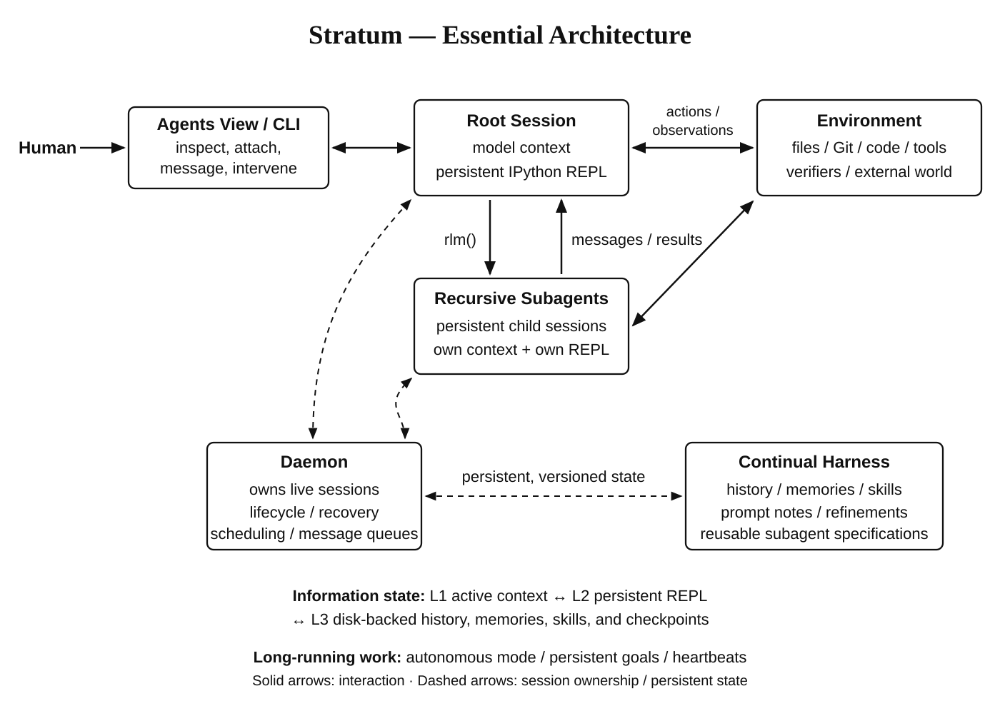

# Stratum

**A persistent agent harness built around Python, recursive agents, and reusable working state.**

Stratum gives a model a long-lived IPython environment for computation, tools, and
agent coordination. A background daemon manages execution; you can steer work,
detach, and return to the same session. The Python package is `threadweave`;
`Stratum` and `threadweave` launch the same CLI.

## Architecture



The root delegates through `rlm()` while continuing its own work. Children have
independent contexts and kernels and can recurse within shared resource limits.

**L1** holds active model context, **L2** persistent Python state, and **L3** durable
history and artifacts. Compaction reduces L1; checkpoints and reconstruction recipes
support recovery after kernel restarts.

## Features

| Capability | What it provides |
| --- | --- |
| **Persistent Python** | Variables, functions, task data, and agent handles survive across turns. Large results can remain outside the model prompt. |
| **Recursive agents** | Concurrent child sessions, parent/child/sibling messaging, follow-up work on existing children, and configurable depth and concurrency. |
| **Continual harness** | Local and global prompt notes, memories, Python skills, and subagent specifications; explicit refinement, automatic review, version history, and rollback. |
| **Coding environment** | Repository search, multilingual syntax indexes, symbol and reference queries, validated edits, Git checkpoints, and isolated candidate workspaces. |
| **Verification and experiments** | Targeted tests, build/lint/type checks, completion gates, profiling, repeated benchmarks, and recorded experiment comparisons. |
| **Session control** | Streaming chat, interventions, pause/resume, detach/reattach, session forks, persistent goals, and interval or cron scheduling. |
| **Extensibility** | Task adapters, capability providers, importable Python skills, MCP over stdio or HTTP, and explicit model/role routing. |
| **Inspectable execution** | Searchable history, optional semantic retrieval, artifacts, provenance, and resource accounting across root, child, and auxiliary calls. |

Automatic refinement reviews root activity every 25 assistant turns and at compaction,
with a configurable cooldown. It can decline changes; accepted edits must identify
reusable behavioral value and apply at safe turn boundaries.

## Quick start

Requires **Python 3.11+**, **uv**, and **Node.js 22.8+**. The default subscription
provider also needs the Codex CLI and its shared ChatGPT login. Building the pinned
inference bridge for the first time requires Git and Rust/Cargo.

```sh
git clone https://github.com/pmukeshreddy/Stratum.git
cd project-Stratum
uv sync --extra dev --locked

uv run Stratum auth status
uv run Stratum auth login           # If you are not already signed in
uv run Stratum auth install-client  # One-time inference bridge build
uv run Stratum doctor --config configs/session.json
uv run Stratum
```

`Stratum auth models` lists available models. Subscription mode needs no API key;
the `chat` provider supports separately configured chat-completion APIs.

| Configuration | Use |
| --- | --- |
| [`configs/session.json`](configs/session.json) | General workspace sessions with Python, processes, agents, and MCP. |
| [`configs/coding.json`](configs/coding.json) | Coding workflows with baseline capture, test protection, and verification. |
| [`configs/kernel.json`](configs/kernel.json) | Performance work with correctness gates and repeated measurements. |

Use `--config` to select a profile. [Configuration models](src/threadweave/models.py)
define provider settings, reasoning effort, tool permissions, and resource limits.

## Working with Stratum

```sh
# Open a coding session in your repository
uv run Stratum --workspace /path/to/repo --config configs/coding.json

# Return to the latest session in the current workspace
uv run Stratum --continue
```

Use `/tree`, `/usage`, `/state`, and `/states` to inspect work; `/refine` and
`/compact` manage learned state and active context. `/exit` detaches; `/help` lists
all controls. `Stratum run` supports autonomous, goal, and heartbeat modes.

Inside the model's persistent Python environment, orchestration looks like:

```python
files = list(workspace.rglob("*.py"))
reviewer = await rlm("Review persistence and report concrete defects.", name="reviewer")
# The handle returns at admission, so local work can continue.
result = await bash("git status --short")
await agents.followup(reviewer, "Also inspect recovery after interruption.")
```

State uses JSON/JSONL plus artifact and checkpoint files. Chat uses the XDG data
directory, an existing workspace `.threadweave` store, or `--data`. Local Python
and shell commands execute with the host user's authority, not in a sandbox.

## Evaluation

| Benchmark | Reported Stratum score |
| --- | ---: |
| **ARC-AGI-3** | **81** |
| **EmulatorBench** | **25** |

These are project-owner-reported results. Run artifacts establish the measured metric,
task selection, model settings, and provenance. EmulatorBench's public-source score
is recorded separately from its official trusted reward.

The [evaluators](src/threadweave/evals) support ARC-AGI-3, EmulatorBench, and EvoCode.
Install their pinned dependencies and official task assets before running:

```sh
uv run Stratum eval arc-agi-3 --config /path/to/evaluation.json
uv run Stratum-emulatorbench preflight --config configs/emulatorbench-public.json
uv run Stratum-emulatorbench run --config configs/emulatorbench-public.json \
  --output .emulatorbench/runs/new-run
```

EmulatorBench/EvoCode hosts use Python 3.12. See [`configs/`](configs) and the
[EmulatorBench setup helper](src/threadweave/evals/emulatorbench_setup.py).
Local results in `results/` and `.emulatorbench/runs/` are ignored by Git.

## Development

```sh
uv run ruff check src tests
uv run ruff format --check src tests
uv run pytest -q
uv build
```

The default suite uses test providers. Live model and external-runtime checks have
separate prerequisites or explicit opt-ins.
Pushes run lint, formatting, and package builds. Tests run only when the GitHub
Actions workflow is triggered manually.
